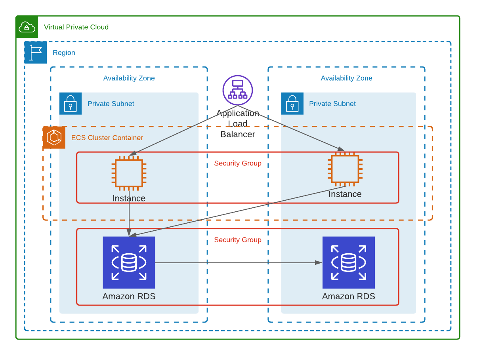

# RampUp 2020: Pizza application

Pizza application in Spring Boot and deploy in AWS.

## Architecture



For the application backend, the infastructure deploy will be:

* Internet gateway.
* Application load balancer.
* Amazon Elastic Container Service with EC2 instances.
* Amazon RDS for MYSQL.

The application frontend is located [here](https://github.com/mnl359/pizzas-frontend/tree/master)

## Software requirements

To run this application without CI/CD tool, the software needed is:

- Maven
- Java
- terraform

Also, an AWS and CircleCI account is required.

## Deploy

First, you need to create a S3 bucket and a DynamoDB table to store the terraform state. Also, change the following variables in the [state_config.tf](terraform/state-config.tf):

| Line | Variable | Description |
| ---- | -------- | ----------- |
| 3    | bucket   | Your bucket name |
| 4    | key      | Path to the state file in the bucket |
| 6    | dynamodb_table | Table to store the terraform Lock |

2. Change the projects [variables](terraform/variables.tf)

| Line | Variable | Description |
| ---- | -------- | ----------- |
| 1    | profile  | AWS profile to execute the terraform |
| 14   | tags     | Adjust the tags for your needs |
| 24   | IP_VPC   | VPC IP for the application |
| 30   | IP_paSUB1| IP for subnet |
| 42   | IP_paSUB2| IP for subnet |
| 68   | asg_max-instances | Maximum running instances in group |
| 74   | asg_min-instances | Minimum running instances in group |
| 68   | asg_desired | Desired running instances in group |
| 99   | docker-image | Docker image for instances |

### Manual

1. Compile with Maven.

```sh
mvn compile
```

2. Create a database and set the environment variables.

```sh
export MYSQL_DB_HOST=localhost
export MYSQL_DB_PORT=3306
export MYSQL_DB_DATABASE=pizzasdb
export MYSQL_DB_USER=root
export MYSQL_DB_PASSWORD=example
```

3. Package and run unit test.

```sh
mvn package
```

4. Build and push the image into docker hub.

5. Enter the terraform directory and run the following commands:

```sh
# Initialize Terraform
terraform init
# Infrastructure checkout
terraform plan
# Infrastructure deploy
terraform apply
```

### Pipeline

1. Follow the project from your CircleCI account.

2. Set the environment variables in CircleCI:

| Variable | Description |
| -------- | ----------- |
| AWS_ACCESS_KEY_ID | AWS access key |
| AWS_DEFAULT_REGION | AWS default region |
| AWS_SECRET_ACCESS_KEY | AWS secret access key |
| DOCKER_LOGIN | Docker username |
| DOCKER_PASSWORD | Docker password |
| MYSQL_DB_PASSWORD | MySQL password |
| MYSQL_DB_USER | MySQL password |

3. Modify some variables in the CircleCI [pipeline](.circleci/config.yml).

| Line | Variable | Description |
| ---- | -------- | ----------- |
| 15   | TF_VAR_db_user | MySQL user |
| 53   | image    | Change for your docker repository |
| 56   | image    | Change for your docker repository |

In the line 112, change the command with your cluster name and service if you change it before in the terraform variables.

4. Build the project.

## Usage

In the terraform output, a variable called API_Backend_url contains the backend API.

---
**NOTE**

To destroy the application manually:

```sh
terraform destroy
```

In the pipeline, commit to a branch called "destroy".

---